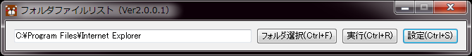
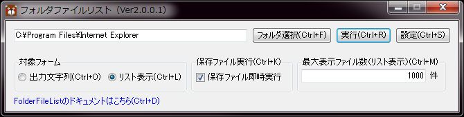
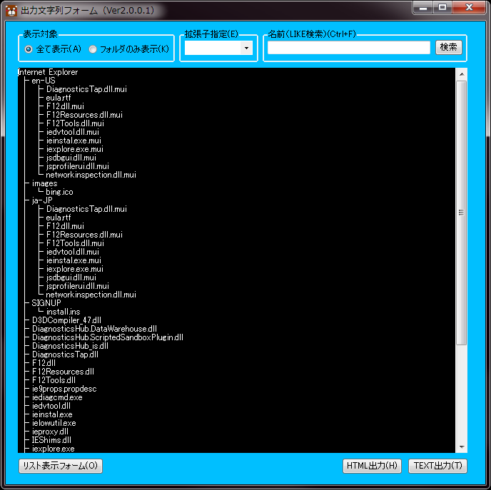
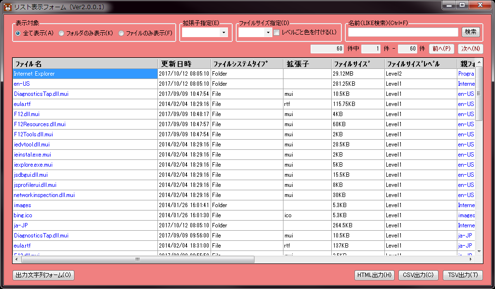
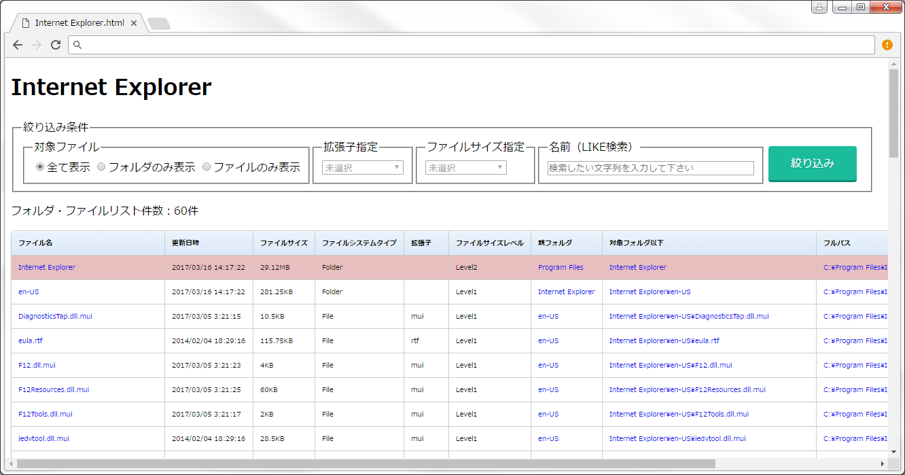

# FolderFileList

対象のフォルダの中を解析し、フォルダとファイルの一覧を確認できます。
また解析したフォルダとファイルの一覧をテキストで出力することができます。

## 使い方

#### **メインフォーム**  

解析したいフォルダの選択、FolderFileListの設定を行うことが出来るフォームです。  

　　**「フォルダ選択(Ctrl+F)」ボタン**  
　　　　フォルダ選択ウインドウが表示されます。解析したいフォルダを選択します。

　　**「実行(Ctrl+R)」ボタン**  
　　　　選択したフォルダの中を解析しフォルダとファイルの一覧の作成を開始します。

　　**「設定(Ctrl+S)」ボタン**  

  

　　　　クリックすると、設定領域が表示されます。  

　　　　　・対象フォーム  
　　　　　　　出力文字列(Ctrl+O)  
　　　　　　　　出力文字列フォームでフォルダ・ファイルの一覧を確認

　　　　　　　リスト表示(Ctrl+L)  
　　　　　　　　リスト表示フォームでフォルダ・ファイルの一覧を確認  

　　　　　・保存ファイル実行(Ctrl+K)  
　　　　　　　保存ファイル即時実行  
　　　　　　　　テキストファイルを出力し保存した後、そのファイルを即時で実行するかどうか

　　　　　・最大表示ファイル数(リスト表示)(Ctrl+M)  
　　　　　　　リスト表示フォームの際、１ページに表示する最大ファイル数  

　　　　　・FolderFileListのドキュメントはこちら(Ctrl+D)  
　　　　　　　FolderFileListのドキュメントページへ遷移します  

#### 出力文字列フォーム  
ツリー形式のフォルダ・ファイルの一覧をテキストで表示します。  

　　**「リスト表示フォーム(O)」ボタン**  
　　　　出力文字列フォームを閉じ、リスト表示フォームを表示します。  

　　**「HTML出力(H)」ボタン**  
　　　　ツリー形式のフォルダ・ファイルの一覧をHTMLファイルで出力します。

　　**「TEXT出力(T)」ボタン**  
　　　　ツリー形式のフォルダ・ファイルの一覧をTEXTファイルで出力します。

#### リスト表示フォーム  
リスト形式のフォルダ・ファイルの一覧を表示します。  

　　**「表示対象」ラジオボタン**  
　　　　表示するファイルの種類を指定出来ます。  
　　　　　・全て表示(A)  
　　　　　　　フォルダ・ファイル全て表示します。  

　　　　　・フォルダのみ表示(K)  
　　　　　　　フォルダのみ表示します。  
　　　　　　　※このボタンをクリックした場合は拡張子指定(E)を使用することは出来ません。

　　　　　・ファイルのみ表示(F)  
　　　　　　　ファイルのみ表示します。  

　　**「拡張子指定(E)」コンボボックス**  
　　　　対象フォルダ内に存在する拡張子のリストが表示されます。  
　　　　選択した拡張子のファイルのみで絞り込みます。  

　　**「ファイルサイズ指定(D)」コンボボックス**  
　　　　ファイルサイズレベルによってフォルダ・ファイルを絞り込みます。  

　　**「レベルごと色を付ける(L)」チェックボックス**  
　　　　ファイルサイズレベルによってフォルダ・ファイルに色を付けて見やすくします。  

　　※ファイルサイズレベルについて  
　　　　Level0：０B以上１KBより小さい  
　　　　Level1：１KB以上１MBより小さい  
　　　　Level2：１MB以上１００MBより小さい  
　　　　Level3：１００MB以上１GBより小さい  
　　　　Level4：１GB以上１０GBより小さい  
　　　　Level5：１０GB以上  

　　**「名前(LIKE検索)(Ctrl+F)」**  
　　　　フォルダ・ファイル名のLIKE検索でフォルダ・ファイル名で絞り込みます。  

　　**「前へ(P)」、「次へ(N)」ボタン**  
　　　　フォルダ・ファイルの件数が最大表示ファイル数を超える時、使用可能になります。  

　　**「出力文字列フォーム(O)」ボタン**  
　　　　リスト表示フォームを閉じ、出力文字列フォームを表示します。  

　　**「HTML出力(H)」ボタン**  
　　　　リスト形式のフォルダ・ファイルの一覧をHTMLファイルで出力します。

　　**「CSV出力(C)」ボタン**  
　　　　リスト形式のフォルダ・ファイルの一覧をCSVファイルで出力します。

　　**「TSV出力(T)」ボタン**  
　　　　リスト形式のフォルダ・ファイルの一覧をTSVファイルで出力します。  

　　**「ファイルの実行」**  
　　　　青文字で表示されている項目（ﾌｧｲﾙ名、親ﾌｫﾙﾀﾞ、対象ﾌｫﾙﾀﾞ以下、ﾌﾙﾊﾟｽ）のファイルを  
　　　　ダブルクリックまたはEnterで実行することができます。複数選択している場合は複数実行できます。  
　　　　※実行されるファイルはOSの関連付けに従って実行されます。  

　　**「ファイルの並び替え」**  
　　　　ヘッダーをクリックまたはリストにフォーカスがある時でShift＋Sでリストのファイルを  
　　　　並び替えることが出来ます。ファイルの並び替えを実行するたび、昇順、降順と切り替わりま。  

　　**「カラムの幅調整」**  
　　　　リストにフォーカスがある時でShift＋Mでリストのカラム幅を自動調整します。  
　　　　カラム幅はヘッダー、対象項目内で一番大きい項目がすべて表示される幅まで自動調整されます。  

#### HTML出力機能  
Html出力したファイルをブラウザで確認すると以下のようなものが表示されます。  

  

出力したHtmlファイル単体でもリスト表示フォームと同じようにファイルの絞り込みが可能です。

## コマンドモード  
FolderFiLeListをコマンドラインから実行するためのコマンドがあります。  

　　**ヘルプ　：　/?**  
　　　　コマンドの一覧を表示します

　　**フォームタイプ　：　/Form=(Text | List)**  
　　　　Text：出力文字列フォームを表示  
　　　　List：リスト表示フォームを表示  
　　　　※デフォルトは「/Form=Text」  

　　**出力形式　：　/Output=(ClipBoard | SaveDialog)**  
　　　　ClipBoard：クリップボードにコピー  
　　　　SaveDialog：名前をつけて保存ダイアログで保存  

　　**拡張子　：　/Extension=(txt | csv | tsv | html)**  
　　　　txt：TXT形式で出力  
　　　　csv：CSV形式で出力  
　　　　tsv：TSV形式で出力  
　　　　html：HTML形式で出力  
　　　　※デフォルトの拡張子はフォームによってことなります。  
　　　　　「/Extension=txt」(/Form=Text)  
　　　　　「/Extension=csv」(/Form=List)  

　　**実行　：　/Execute**  
　　　　保存したファイルをただちに実行します。  

　　**最大表示ファイル数　：　/PageSize=数値**  
　　　　数値のみ有効でそれ以外は無視されます。  
　　　　リスト表示フォームの際、１ページに表示する最大ファイル数の設定です。  

　　不正なコマンドライン引数を使用した場合  
　　　　不正なキーワードの場合は無視されます。  
　　　　不正な値の場合はデフォルト設定で実行されます。  

#### 送るフォルダにFolderFileListを登録  

「CreateCommandModeLinks.vbs」を実行することで「送る」フォルダにFolderFileListのコマンドモード  
処理を登録することが出来ます。登録される処理は以下のとおりです。  

　　・出力文字列フォームを表示  
　　・出力文字列をクリップボードにコピー  
　　・出力文字列を保存し実行(TXT)  
　　・出力文字列を保存し実行(HTML)  
　　・リストフォームを表示  
　　・リストをクリップボードにコピー(CSV)  
　　・リストをクリップボードにコピー(TSV)  
　　・リストを保存し実行(CSV)  
　　・リストを保存し実行(TSV)   
　　・リストを保存し実行(HTML)   
